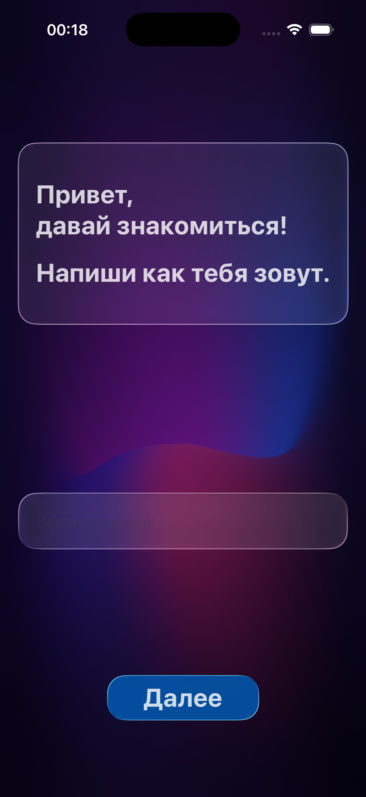
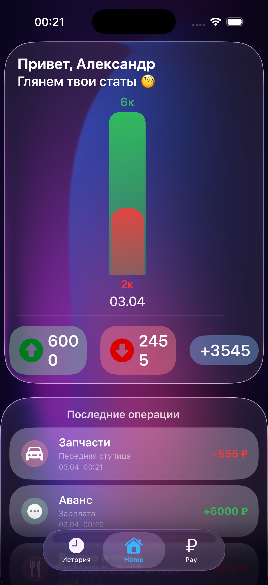
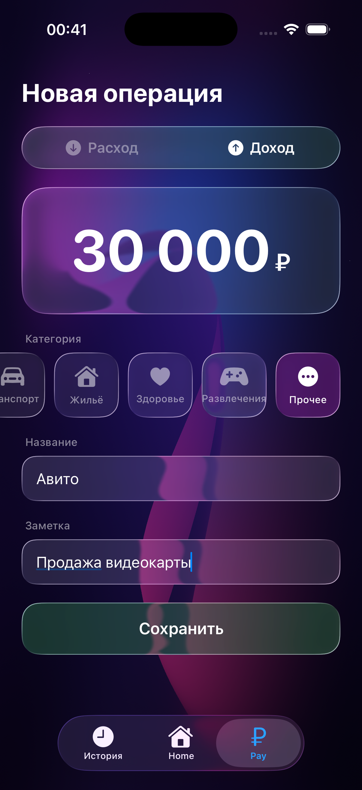
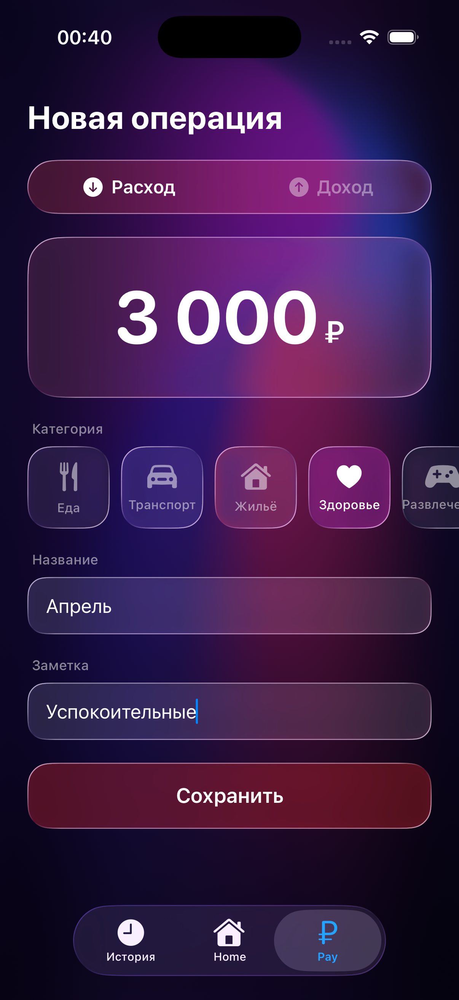
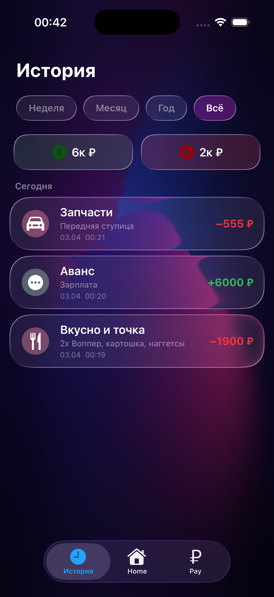
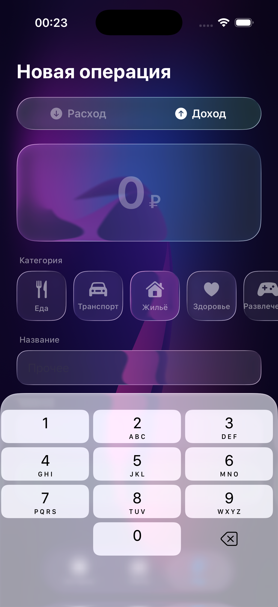

Simple app that tracks your financial operations

Used swiftData and fully builded with new LiquidGlass UI style

Known problems:
Several Liqud elements are located on top of each other. That causes some rendering issues when Liquid glass disables until they dont reappear.

Some screenshots:

